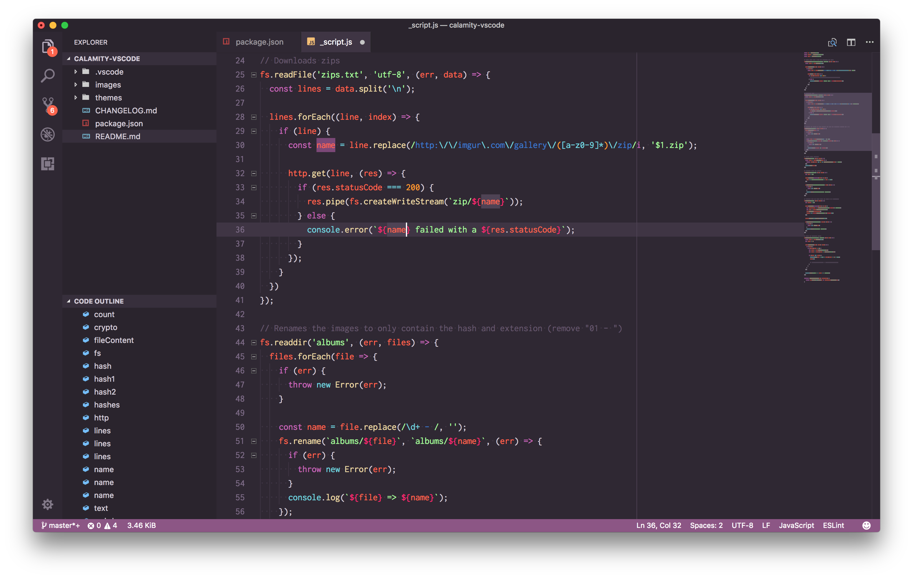

# [Calamity Theme for VSCode](https://marketplace.visualstudio.com/items?itemName=pustur.calamity-vscode)
> A purple dark theme with medium to high contrast for [Visual Studio Code](https://code.visualstudio.com)

## Supported languages

- JavaScript
- CSS
  - SCSS
  - Sass
  - Less
- PHP
- SQL
- Pug / Jade
- Python
- HTML / XML
- Markdown
- JSON
- YAML
- Go

## Supported applications

Also available for:

- [Atom](https://atom.io/themes/calamity-syntax)
- [Sublime Text](https://github.com/Pustur/calamity-sublime)
- [iTerm2](https://github.com/mbadolato/iTerm2-Color-Schemes#calamity)

## Contributing

If you want more languages a PR is always welcome! 🙂

## License

[MIT](LICENSE.md)
